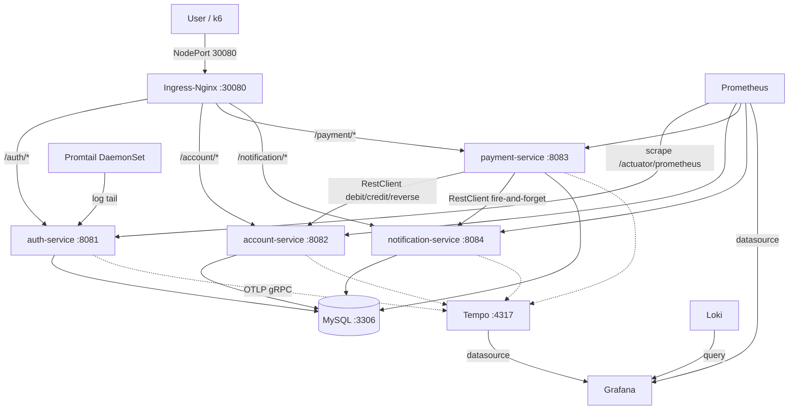

# Bank Mall Cloud-Native Platform

银行电商云原生平台，跑在 4 台 VMware 虚拟机的真实 K8s 集群上。4 个 Spring Boot 微服务（BCrypt+JWT、JPA+乐观锁、RestClient+补偿事务），完整可观测性（Prometheus+Grafana+Loki+Jaeger），NetworkPolicy 零信任安全模型，ArgoCD GitOps 交付。经混沌工程验证：NetworkPolicy 误配、HPA 冷启动风暴、分布式追踪根因分析。

A cloud-native microservices platform running on a real 4-node VMware K8s cluster. Four Spring Boot services with full observability, zero-trust NetworkPolicy, ArgoCD GitOps, and chaos-engineering-validated resilience.

[](https://github.com/qieqiuyue/bank-mall-platform/actions)
[](https://adoptium.net/)
[](https://spring.io/projects/spring-boot)
[](https://kubernetes.io/)
[](LICENSE)

## 项目数据 / By the Numbers

| 指标 | 数值 |
|------|------|
| 微服务 | 4（auth, account, payment, notification） |
| 单元测试 | 45 |
| K8s 资源 | 16（含监控/安全/网络策略） |
| 活跃文档 | 13 篇（47 篇归档至 Git 历史） |
| CI/CD 全流程 | 211 秒（harbor01 `bash scripts/ci.sh`） |
| PR 合并 | 20 |
| Git commits | 153 |
| 版本 Tags | 2（v1.0.0-s3, v1.0.0-s4） |
| 运维 Skill | 9 个 |
| 集群节点 | 4 台 VMware VM（1 master + 2 worker + 1 harbor） |
| 故障演练场景 | 2/3 通过（NetworkPolicy 误配 + Jaeger trace 验证） |

## 交付总结 / Delivery Journey

| Phase | 内容 | 状态 |
|-------|------|:---:|
| S0 | 集群抢救 + Spring Boot 4.0.6 升级 | ✅ |
| S1 | 业务闭环：auth JWT + account JPA + payment 补偿 + notification | ✅ |
| S2 | 平台矩阵：ArgoCD, Jaeger, Prometheus, Grafana, Loki, Sealed Secrets, NetworkPolicy | ✅ |
| S3 | CI/CD：GitHub Actions 5-job pipeline + harbor01 `scripts/ci.sh` | ✅ |
| S4 | 故障演练：100/200 压测 + HPA 扩容 + NetworkPolicy 排障 + Jaeger trace | ✅ |
| S5 | 润色：Swagger, Helm, HA 设计, README 重写 | ✅ |
| S6 | 加分：Velero, Argo Rollouts, Kyverno | ⚪ |

## Architecture



```
4 × VM (VMware NAT, 10.0.0.0/24)
├── k8s-master01  10.0.0.31   Control Plane
├── k8s-worker01  10.0.0.41   Worker
├── k8s-worker02  10.0.0.42   Worker
└── harbor01      10.0.0.61   Harbor Registry + Build Node
```

## Tech Stack

| Domain | Choice |
|--------|--------|
| Language | Java 21 LTS |
| Framework | Spring Boot 4.0.6 (Spring Framework 7.0) |
| HTTP Client | RestClient (SB 3.2+, synchronous) |
| Database | MySQL 8.0 — one database per service |
| Migrations | Flyway |
| Auth | BCrypt + JWT (jjwt 0.12.6) |
| Transactions | Compensation-based eventual consistency + idempotency keys |
| API Docs | Swagger / OpenAPI (springdoc v3.0.0) |
| Container Runtime | containerd + Calico (IPIP) |
| Ingress | Ingress Nginx (DaemonSet, NodePort 30080) |
| Registry | Harbor (private, 10.0.0.61) |
| GitOps | ArgoCD |
| Secrets | Bitnami Sealed Secrets |
| Metrics | Prometheus + Micrometer |
| Dashboards | Grafana (provisioned, 3 alert rules) |
| Logs | Loki + Promtail |
| Tracing | Grafana Tempo + OpenTelemetry Java Agent |
| SAST / Secret Detection | Semgrep + Gitleaks |
| CI/CD | GitHub Actions (5 jobs) + `scripts/ci.sh` (Trivy soft gate, NJU mirror) |
| Packaging | Helm Chart skeleton (Kustomize is V1 source of truth) |

## Quick Start

```bash
# Build a single service (skip tests)
cd apps/auth-service && mvn clean package -DskipTests

# Run with H2 in-memory database
java -jar target/auth-service-1.0.0.jar --spring.profiles.active=h2

# Makefile shortcuts (master01 / WSL2; harbor01: use bash scripts/ci.sh directly)
make help
make build    # mvn clean package -DskipTests × 4
make test     # mvn test × 4
make ci       # 一键 CI/CD（harbor01: bash scripts/ci.sh）
make smoke-test  # 端到端验证
```

**CI/CD 通知**：GitHub Actions 和 `scripts/ci.sh` 均支持飞书 Webhook。在 GitHub 仓库 Settings → Secrets and variables → Actions 中添加 `FEISHU_WEBHOOK` secret 即可启用。

## Repository Structure

```
bank-mall-platform/
├── apps/                              # 4 Spring Boot microservices (Maven parent POM)
│   ├── auth-service/                  # BCrypt + JWT authentication
│   ├── account-service/               # JPA + Flyway + optimistic locking
│   ├── payment-service/               # RestClient + compensation + idempotency
│   └── notification-service/          # Notification persistence
├── infra/                             # Infrastructure as Code
│   ├── kubernetes/base/               # K8s manifests (deployments, services, ingress, monitoring, security, hpa, jaeger)
│   ├── kubernetes/cloud/              # Kustomize overlay for ACK cloud (LB ingress, no OTEL)
│   ├── kubernetes/argocd/             # ArgoCD Application CRs
│   ├── helm/bank-mall/                # Helm Chart skeleton (V1: Kustomize is source of truth)
│   └── dashboards/                    # Grafana dashboard JSON (business + SLI/SLO)
├── scripts/                           # build-images.sh, deploy.sh, smoke-test.sh, ci.sh, preflight.sh, teardown.sh, db-backup.sh, db-seed-accounts.sh
├── tests/                             # k6 load test + payment-load.sh
├── .github/workflows/ci.yml           # 5-job pipeline: gitleaks → semgrep/test → build+trivy → feishu
├── docs/                              # 12 active docs (47 archived in Git history)
├── Makefile
├── ROADMAP.md
└── SECURITY.md
```

## Key Documents

| Document | Content |
|----------|---------|
| [`ROADMAP.md`](ROADMAP.md) | Phase status, explicit exclusions, V2 plans |
| [`docs/project-journal.md`](docs/project-journal.md) | S0–S6 timeline: decisions, pitfalls, key data |
| [`docs/13-design-decisions.md`](docs/13-design-decisions.md) | Technology choices with rationale |
| [`docs/14-troubleshooting-handbook.md`](docs/14-troubleshooting-handbook.md) | Debugging guide by problem category |
| [`docs/chaos-engineering-postmortem.md`](docs/chaos-engineering-postmortem.md) | S4 chaos engineering: load test + NetworkPolicy + Jaeger |
| [`docs/ha-architecture-design.md`](docs/ha-architecture-design.md) | 3-master HA + Keepalived brain-split protection |
| [`docs/redis-idempotency-design.md`](docs/redis-idempotency-design.md) | Idempotency design: DB UNIQUE vs Redis SETNX |
| [`docs/interview/interview-qa.md`](docs/interview/interview-qa.md) | Interview Q&A (29 questions) |
| [`docs/interview/interview-script.md`](docs/interview/interview-script.md) | 3/5/10 minute interview scripts |
| [`CONTRIBUTING.md`](CONTRIBUTING.md) | Dev setup, pre-commit hooks, doc naming conventions |

## License

MIT — see [LICENSE](LICENSE).
