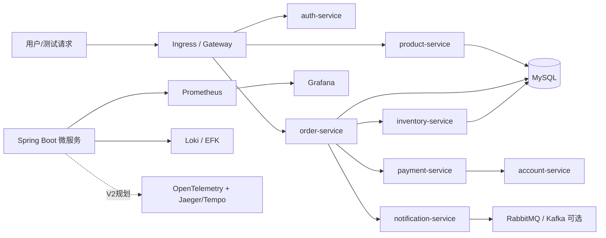

# 项目定位：某银行电子商城云原生改造与 Kubernetes 实验集群部署实践

## 背景包装

某银行原有电子渠道系统包含用户认证、账户查询、商城商品、订单支付、交易通知等业务能力。传统部署方式依赖手工发布，存在版本不可控、扩容不灵活、故障影响范围大、日志和监控分散等问题。

本项目以该业务场景为背景，将系统拆分为多个 Spring Boot 微服务，并基于 Kubernetes 进行容器化部署改造。项目重点不是简单把服务跑起来，而是围绕企业实际交付中常见的问题，逐步补齐镜像管理、服务发布、配置管理、弹性伸缩、监控告警、日志采集和安全加固能力。V1 是单控制面实验集群；高可用集群、链路追踪和更多业务服务属于 V2 规划。

## 项目目标

- 将银行电子商城业务拆分为多个微服务，降低模块耦合。
- 使用 Docker 构建服务镜像，并推送到 Harbor 私有镜像仓库。
- 使用 Kubernetes Deployment 和 Service 管理服务实例与服务发现。
- 使用 Ingress 或网关统一暴露外部访问入口。
- 使用 ConfigMap 和 Secret 解耦配置与敏感信息。
- 使用 readinessProbe、livenessProbe 和资源限制提升服务稳定性。
- 使用 HPA 实现基于指标的自动扩缩容。
- 接入 Prometheus、Grafana、Loki/Promtail 和 Grafana Alerting，提升故障定位效率。
- 设计 Kubernetes 高可用集群部署方案，理解控制平面、etcd、负载均衡和故障恢复；V1 不宣称已落地多 master 高可用。

## 业务模块规划

第一版保留原始案例中的 4 个服务，后续扩展为更像电子商城的业务结构。

| 阶段 | 服务 | 说明 |
| --- | --- | --- |
| V1 | auth-service | 用户登录、token 返回、健康检查 |
| V1 | account-service | 账户余额查询 |
| V1 | payment-service | 转账/支付模拟 |
| V1 | notification-service | 通知发送模拟 |
| V2 | product-service | 商品列表、商品详情、商品状态 |
| V2 | order-service | 创建订单、订单查询、订单状态 |
| V2 | inventory-service | 库存查询、库存扣减 |
| V2 | gateway-service | 统一入口、路由转发、基础鉴权 |

## 技术架构规划

## 高可用集群规划

学习环境可以分两步走：

| 阶段 | 集群形态 | 目标 |
| --- | --- | --- |
| 入门阶段 | 1 master + 2 worker | 跑通服务部署、网络、存储、访问 |
| 进阶阶段 | 3 master + 2 worker + 2 LB | 理解 kube-apiserver 高可用、etcd 高可用、节点故障恢复 |

推荐高可用拓扑：

| 节点类型 | 数量 | 组件 |
| --- | --- | --- |
| LB | 2 | HAProxy + Keepalived，提供 API Server VIP |
| Control Plane | 3 | kube-apiserver、controller-manager、scheduler、etcd |
| Worker | 2-3 | 业务 Pod、Ingress Controller、监控组件 |
| Harbor | 1 | 私有镜像仓库 |
| Storage | 1+ | NFS 入门，后续可扩展 Longhorn/Ceph |

## 简历表达边界

推荐表达：

> 参考银行电子商城业务场景，搭建了一套 Kubernetes 云原生部署实战环境，完成 Spring Boot 微服务容器化、K8s 部署、配置管理、健康检查、弹性伸缩、监控告警和日志采集，并设计了高可用集群与链路追踪的后续方案。

不推荐表达：

> 独立负责某银行生产系统上线。

更稳妥、更抗追问的说法是“模拟企业真实场景”“学习/实战项目”“完成核心链路并设计生产化改造方案”。
