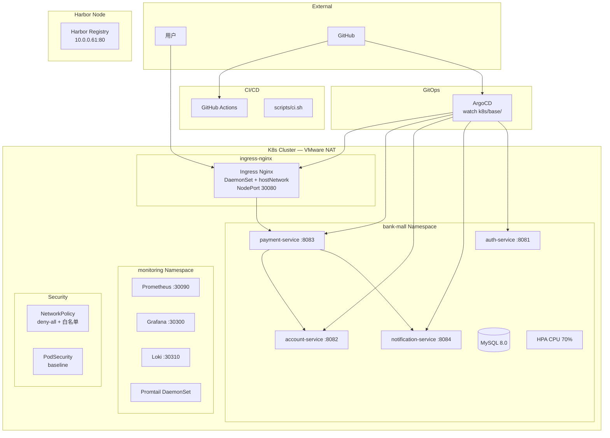

# 系统架构

> 银行商城云原生平台整体架构图与组件说明。

---

## 架构总览



---

## 组件说明

### 微服务层（bank-mall Namespace）

| 组件 | 端口 | 技术栈 | 数据库 |
|------|------|--------|--------|
| auth-service | 8081 | Spring Boot 3.2, JWT, BCrypt | `bank_auth` |
| account-service | 8082 | Spring Boot 3.2, JPA, Flyway, 乐观锁 | `bank_account` |
| payment-service | 8083 | Spring Boot 3.2, RestClient, 补偿逻辑 | `bank_payment` |
| notification-service | 8084 | Spring Boot 3.2, JPA, Flyway | `bank_notification` |

### 调用链（支付场景）

```
POST /api/payments
  → Ingress Nginx (NodePort 30080)
    → payment-service:8083
      → account-service:8082  POST debit   (扣款)
      → account-service:8082  POST credit  (入账)
      → notification-service:8084 POST      (通知)
      失败 → catch → POST reverse (冲正)
              reverse 失败 → 重试 3 次 → ERROR_MANUAL_REVIEW
```

### 基础设施

| 节点 | IP | 角色 |
|------|-----|------|
| k8s-master01 | 10.0.0.31 | Control Plane |
| k8s-worker01 | 10.0.0.41 | Worker（MySQL pinned） |
| k8s-worker02 | 10.0.0.42 | Worker（可观测性） |
| harbor01 | 10.0.0.61 | Harbor Registry |

### 关键设计决策

| 决策 | 选型 | 理由 |
|------|------|------|
| HTTP 客户端 | RestClient | Spring Boot 3.2 官方推荐 |
| 网关 | Ingress Nginx | K8s 原生 |
| 服务发现 | CoreDNS + Service | 无需注册中心 |
| 链路追踪 | Jaeger + Badger | 零外部依赖 |
| Secret | Sealed Secrets | GitOps 原生 |
| 分布式事务 | 补偿逻辑 | 贴近真实支付系统 |

---

**最后更新**：2026-06-02 | S0 初始化中
